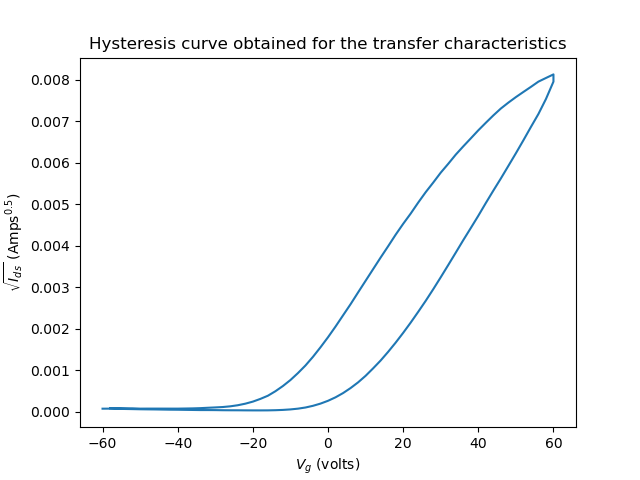

# Fetter: FET parameter estimator

Fetter is a python package made for estimation of electrical transport parameters such as mobility, hysteresis characterization, conductivity (forward & backward), etc. from experimental data. Currently the package works for a limited set of parameters: conductivity estimation for a two-terminal device and conductivity, mobility, threshold voltage estimation for a three-terminal device (MOSFET in particular).

This package is GPL v3.0 licensed.

It is quite easy to use:
```python
>>> import fetter
>>> device = fetter.Mosfet(output_file, transfer_file)
>>> device.transfer.origplot()
```



Now, we estimate the linear regime of the plot. Visually, we see that linearity is present between _y_ values 0.002 - 0.004.

```python
>>> device.transfer.getLinear(0.002, 0.004)
>>> device.transfer.mobility(1e-4, 1e-3, 1e-8)
0.3856965836888316
```

Here the arguments of `device.transfer.mobility()` are the dimensions of the device i.e. length, width and capacitance per unit area in the order of appearance (in SI units).

## Acknowledgements

This project would not have been possible without the constant guidance of Dr. Satyaprasad Senanayak, Assistant Professor, Nanodevice & Physics laboratory, NISER ([satyaprasad@niser.ac.in](mailto:satyaprasad@niser.ac.in)).

## Contributions

I wrote this package as part of my project for the P452 computational physics course at NISER but intend on maintaining it for the foreseeable future. Please feel free to raise an issue in the issue tracker and I'm more than happy to welcome pull requests!

## Author details

 - Ashish Panigrahi ([ashish.panigrahi@niser.ac.in](mailto:ashish.panigrahi@niser.ac.in))
